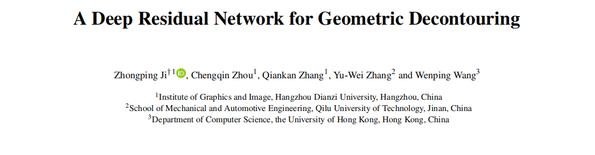
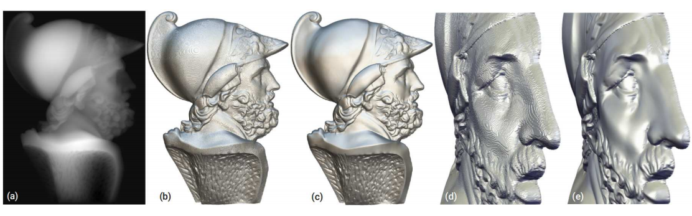
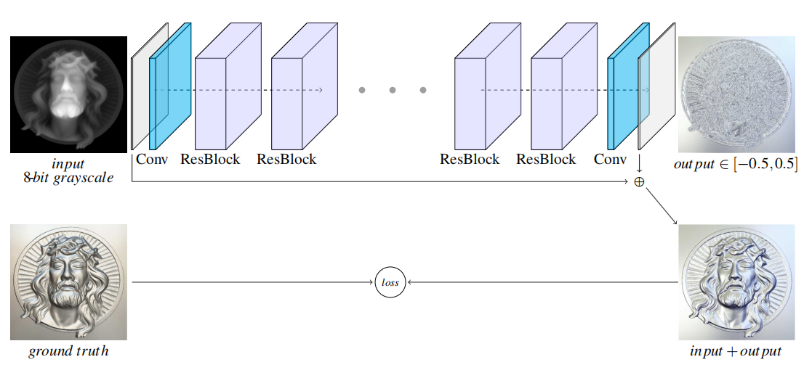
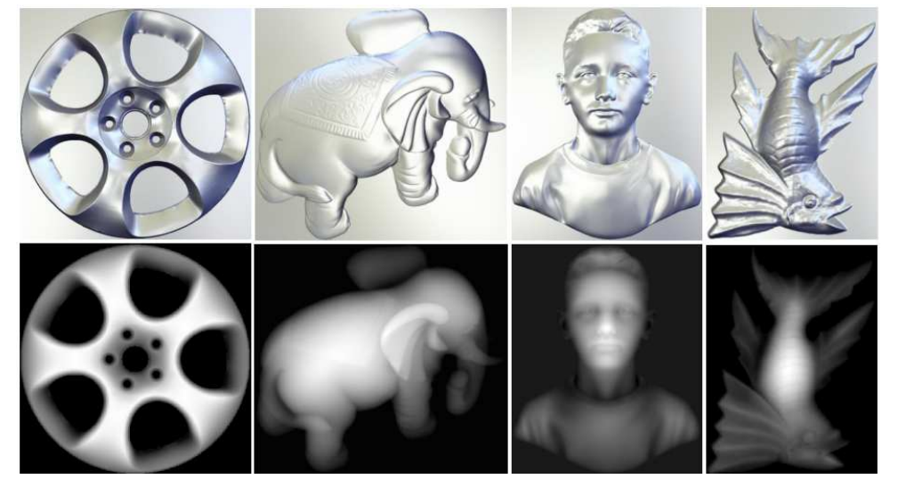

# A Deep Residual Network for Geometric Decontouring



## Introduction



Figure 1: Geometric Decontouring for grayscale image. (a) An input grayscale. (b) Convert (a) to a 3D mesh. Note that the false contours arise. (c) Our network eliminates the false contours and preserves the fine details well. (d-e) Close-ups of (b) and (c).

For details, please refer to our paper [A Deep Residual Network for Geometric Decontouring](./GDCNet_PG2020.pdf).

## Architecture



Figure 2: Architecture of our network for geometric detail restoration from an 8-bit grayscale image. Our network consists of two convolutional layers and several residual blocks. The gray dots indicate repetition of the residual blocks. The output of our network is the predicted residual errors.


## Dataset



Figure 3: Some samples of our Height-Grayscale Dataset. The images shown in the top row are height maps, and the images in the bottom row are grayscales. A height map encodes the geometric details, so here we render it as a surface.


- The structure tree of the dataset:
```bash
./Height-Grayscale-Dataset
├── .
├── gray
├── └── 0.png
├──  ...
├──
├── height
├── └── 0.mat
├──  ...
├──
├── mask
├── └── 0.png
├──  ...  

```


The full dataset will be released soon.  
